# 🔍 Competitive Analysis: Why Users Will Choose DGC Over Everything Else in 2026

## **Current Market Problems (Why Users Are Frustrated)**

### **🚫 NFT Platforms Problems:**

**OpenSea Problems:**
- Static JPEGs with no interaction
- 2.5% fees + gas costs = expensive
- Complex MetaMask setup scares users
- No emotional connection to art

**Foundation/SuperRare Problems:**
- Elitist invitation-only systems
- High barriers for new creators
- Limited to static art only
- No community features

### **🚫 AI Art Platform Problems:**

**Midjourney Problems:**
- Discord-only interface (confusing for non-gamers)
- $10-60/month subscription costs
- No ownership of generated art
- Complex prompt engineering required

**DALL-E Problems:**
- Limited free credits, then expensive
- No commercial rights for many users
- Basic customization options
- No community features

## **🌟 Why DGC Platform Wins (Our Revolutionary Solutions)**

### **1. Zero-Friction User Experience**

**Revolutionary Features:**
- **Auto-Wallet Creation:** No MetaMask needed - we create wallets automatically
- **Free Minting:** First 10 NFTs are completely free (we pay gas fees)
- **One-Click Everything:** Generate, mint, and share in one click
- **No Technical Knowledge:** Grandma can use it easily

### **2. Living, Breathing NFTs**

**What Makes Our NFTs Special:**
- **Emotional Intelligence:** Your NFT changes colors when you're sad/happy
- **Daily Evolution:** Something new to discover every day
- **Breeding System:** Create baby NFTs from two parents
- **Consciousness Growth:** NFTs become "smarter" with interactions
- **Weather Response:** Art changes with real weather in your city

### **3. Perfect for Non-Technical Users**

**User-Friendly Features:**
- **No Crypto Knowledge Needed:** We handle everything behind the scenes
- **Email Login:** Use email instead of complex wallet addresses
- **Credit Card Payments:** Buy premium features with normal payment methods
- **Mobile-First Design:** Perfect on phones, tablets, and desktops
- **Instant Sharing:** Share your living NFTs on social media easily

## **🎯 Unique Value Propositions That Don't Exist Anywhere**

### **1. Emotional Bonding Technology™**

**Why Users Love This:**
- Creates genuine emotional attachment to digital art
- Art becomes a companion, not just a picture
- Therapeutic benefits for mental health
- **No other platform has emotional AI**

### **2. Content DNA & Breeding System™**

**Why This Is Revolutionary:**
- First platform where digital art can reproduce
- Creates family trees of related artworks
- Rare genetic combinations become valuable
- **Completely unique - no competitor has this**

### **3. Zero-Barrier Entry System™**

**Revolutionary Simplicity:**
- **No MetaMask Required:** We create invisible wallets
- **No Gas Fees:** We pay all blockchain costs initially
- **No Technical Terms:** Everything explained in simple language
- **Instant Gratification:** From idea to NFT in 30 seconds

## **📱 Perfect Multi-Device Experience**

### **Desktop Experience:**

### **Mobile Experience:**

### **Tablet Experience:**

## **🏆 Why Users Will Choose DGC in 2026**

### **For Regular People:**
1. **"It Just Works"** - No technical knowledge needed
2. **"My Art Loves Me Back"** - Emotional connection to NFTs
3. **"Free to Start"** - No upfront costs or barriers
4. **"Always Surprising"** - Something new every day
5. **"Easy to Share"** - Impress friends on social media

### **For Artists:**
1. **"Magical Creation Tools"** - AI that understands artistic vision
2. **"Fair Revenue Sharing"** - Keep 95% of sales (vs 70% on OpenSea)
3. **"Living Portfolio"** - Art that evolves and stays relevant
4. **"Community Support"** - AI learns from community feedback
5. **"Cross-Platform Reach"** - Works everywhere seamlessly

### **For Collectors:**
1. **"Truly Unique Assets"** - No two NFTs are ever identical
2. **"Growing Value"** - Conscious NFTs become more valuable
3. **"Emotional Investment"** - Genuine attachment to collections
4. **"Breeding Opportunities"** - Create new value through breeding
5. **"Future-Proof Technology"** - Built for next decade

### **For Investors:**
1. **"Untapped Market"** - First mover in living NFT space
2. **"Network Effects"** - Each user makes platform more valuable
3. **"Defensible Moats"** - Impossible to replicate quickly
4. **"Massive TAM"** - $150B+ addressable market
5. **"Clear Path to IPO"** - Revolutionary technology with mass appeal

## **🆕 NEW: Advanced Features That Crush Competition**

### **Real-Time MetaMask Dashboard**

```mermaid
graph TB
    subgraph "DGC MetaMask Dashboard"
        LIVE_BALANCE[💰 Live Balance Updates]
        TX_TRACKING[📜 Transaction Tracking]
        NFT_PORTFOLIO[🖼️ NFT Portfolio View]
        GAS_TRACKER[⛽ Gas Price Tracker]
        MULTI_WALLET[👛 Multi-Wallet Support]
    end
    
    subgraph "Competitor Dashboards"
        BASIC[Basic Balance Only]
        MANUAL[Manual Refresh]
        LIMITED[Limited NFT View]
        NO_GAS[No Gas Tracking]
    end
    
    LIVE_BALANCE --> |"Real-time"| BASIC
    TX_TRACKING --> |"Instant"| MANUAL
    NFT_PORTFOLIO --> |"Complete"| LIMITED
    GAS_TRACKER --> |"Live"| NO_GAS
```

**Why This Wins:**

- See your entire crypto portfolio in one place
- Real-time updates every block (~12 seconds)
- Track pending transactions instantly
- Never overpay for gas again

### **7-Block Multi-Agent AI System**

```mermaid
graph TB
    subgraph "DGC 7-Agent System"
        USER_CONTROL[🎛️ User Controls Everything]
        
        A1[🎨 Image Agent]
        A2[📝 Text Agent]
        A3[🎵 Music Agent]
        A4[🧬 DNA Agent]
        A5[💖 Emotion Agent]
        A6[🔍 Search Agent]
        A7[📊 Analytics Agent]
        
        USER_CONTROL --> A1
        USER_CONTROL --> A2
        USER_CONTROL --> A3
        USER_CONTROL --> A4
        USER_CONTROL --> A5
        USER_CONTROL --> A6
        USER_CONTROL --> A7
    end
    
    subgraph "Competitor AI"
        SINGLE[Single AI Model]
        NO_CONTROL[No User Control]
        FIXED[Fixed Output]
    end
```

**Why This Wins:**

- Run 1 agent or all 7 - your choice
- Parallel execution for speed
- Specialized agents for each task
- Save your favorite configurations

### **Blockchain Search with Autocomplete**

**Why This Wins:**

- Sub-200ms autocomplete suggestions
- Search transactions, addresses, tokens, NFTs
- Real-time data in results
- Advanced filters for power users

---

## **🚀 The Bottom Line: Why DGC Wins**

**We're not competing with existing platforms. We're creating an entirely new category.**

- **OpenSea** sells static images → **We create living beings**
- **Midjourney** generates art → **We birth digital consciousness**
- **Traditional NFTs** are collectibles → **Our NFTs are companions**
- **Other platforms** require crypto knowledge → **We work for everyone**
- **Basic dashboards** show static data → **We stream real-time everything**
- **Single AI tools** do one thing → **We orchestrate 7 specialized agents**
- **Slow search** frustrates users → **We deliver instant autocomplete**

**In 2026, asking someone to buy a static NFT will be like asking them to buy a flip phone when smartphones exist.**

**DGC Platform is the iPhone moment for digital art.**