# 🚀 DGC Platform: Implementation Roadmap 2025-2026

## Executive Summary

This roadmap transforms the DGC Platform into a revolutionary ecosystem with advanced MetaMask integration, multi-agent AI dashboard, and real-time blockchain search capabilities.

---

## 📊 Roadmap Overview


---

## Phase 1: MetaMask Real-Time Dashboard (Q1 2025)

### 1.1 MetaMask Integration Architecture


### 1.2 Implementation Tasks

| Task | Description | Duration | Priority |
|------|-------------|----------|----------|
| Wallet Hook Enhancement | Extend useWallet with real-time subscriptions | 5 days | High |
| Balance Tracker | Live ETH/token balance updates | 3 days | High |
| Transaction Monitor | Real-time TX status tracking | 4 days | High |
| NFT Portfolio Scanner | Fetch and display owned NFTs | 5 days | Medium |
| Gas Price Widget | Live gas price estimation | 2 days | Medium |
| Network Switcher | Auto-detect and switch networks | 3 days | High |

### 1.3 Backend API Endpoints

```python
# New API Endpoints for MetaMask Dashboard

# GET /api/wallet/{address}/balance
# Returns: { eth: "1.5", tokens: [...], usd_value: "3500.00" }

# GET /api/wallet/{address}/transactions
# Returns: { transactions: [...], pending: [...] }

# GET /api/wallet/{address}/nfts
# Returns: { nfts: [...], total_count: 42 }

# GET /api/gas/prices
# Returns: { slow: 20, standard: 35, fast: 50 }

# WebSocket /ws/wallet/{address}
# Streams: balance updates, new transactions, NFT transfers
```

### 1.4 Frontend Components

```jsx
// MetaMask Dashboard Component Structure

MetaMaskDashboard/
├── index.jsx                 // Main dashboard container
├── BalanceCard.jsx          // ETH and token balances
├── TransactionList.jsx      // Recent transactions
├── NFTPortfolio.jsx         // NFT grid display
├── TokenHoldings.jsx        // ERC-20 token list
├── GasPriceWidget.jsx       // Gas price tracker
├── NetworkIndicator.jsx     // Current network display
└── WalletActions.jsx        // Send, receive, swap buttons
```

---

## Phase 2: 7-Block Multi-Agent AI Dashboard (Q1-Q2 2025)

### 2.1 Agent System Architecture

```mermaid
graph TB
    subgraph "User Control Layer"
        MASTER_TOGGLE[Master Toggle: All Agents]
        SINGLE_SELECT[Single Agent Selection]
        CUSTOM_SELECT[Custom Multi-Select]
        PRESET_MANAGER[Preset Configurations]
    end
    
    subgraph "Agent Controller"
        ORCHESTRATOR[Agent Orchestrator]
        QUEUE_MANAGER[Task Queue Manager]
        RESULT_AGGREGATOR[Result Aggregator]
    end
    
    subgraph "7 AI Agent Blocks"
        A1[🎨 Image Generation<br/>Stable Diffusion]
        A2[📝 Text Generation<br/>GPT-4/Claude]
        A3[🎵 Music Generation<br/>MusicGen]
        A4[🧬 DNA Evolution<br/>Genetic Algorithm]
        A5[💖 Emotional AI<br/>Emotion Detection]
        A6[🔍 Blockchain Search<br/>Index Query]
        A7[📊 Analytics<br/>Portfolio Analysis]
    end
    
    MASTER_TOGGLE --> ORCHESTRATOR
    SINGLE_SELECT --> ORCHESTRATOR
    CUSTOM_SELECT --> ORCHESTRATOR
    PRESET_MANAGER --> ORCHESTRATOR
    
    ORCHESTRATOR --> QUEUE_MANAGER
    QUEUE_MANAGER --> A1
    QUEUE_MANAGER --> A2
    QUEUE_MANAGER --> A3
    QUEUE_MANAGER --> A4
    QUEUE_MANAGER --> A5
    QUEUE_MANAGER --> A6
    QUEUE_MANAGER --> A7
    
    A1 --> RESULT_AGGREGATOR
    A2 --> RESULT_AGGREGATOR
    A3 --> RESULT_AGGREGATOR
    A4 --> RESULT_AGGREGATOR
    A5 --> RESULT_AGGREGATOR
    A6 --> RESULT_AGGREGATOR
    A7 --> RESULT_AGGREGATOR
```



### 2.2 Agent Execution Flow


### 2.3 Implementation Tasks

| Task | Description | Duration | Priority |
|------|-------------|----------|----------|
| Agent Controller Service | Backend orchestration system | 7 days | High |
| Agent Block Components | 7 individual agent UI blocks | 10 days | High |
| Execution Mode Selector | Single/All/Custom mode UI | 3 days | High |
| Progress Tracking | Real-time progress indicators | 4 days | Medium |
| Result Aggregation | Combine multi-agent results | 5 days | High |
| Preset System | Save/load agent configurations | 4 days | Medium |
| Agent Chaining | Output-to-input agent linking | 6 days | Low |

### 2.4 Agent Configuration Schema

```python
# Agent Configuration Model

class AgentConfig:
    agent_id: str           # "image", "text", "music", etc.
    enabled: bool           # User toggle state
    priority: int           # Execution priority (1-7)
    parameters: dict        # Agent-specific settings
    timeout_seconds: int    # Max execution time
    retry_count: int        # Retry on failure

class AgentPreset:
    preset_id: str
    name: str
    description: str
    agents: List[AgentConfig]
    created_at: datetime
    user_id: str

class AgentExecutionRequest:
    mode: str               # "single", "all", "custom"
    selected_agents: List[str]
    input_data: dict
    chain_outputs: bool     # Enable agent chaining
```

---

## Phase 3: Blockchain Search with Autocomplete (Q2 2025)

### 3.1 Search System Architecture


### 3.2 Autocomplete Flow


### 3.3 Implementation Tasks

| Task | Description | Duration | Priority |
|------|-------------|----------|----------|
| Search Index Setup | Elasticsearch/PostgreSQL indexes | 5 days | High |
| Suggestion Engine | Autocomplete algorithm | 7 days | High |
| Search UI Component | Input with dropdown | 4 days | High |
| Result Cards | Category-specific result displays | 5 days | Medium |
| Cache Layer | Redis caching for suggestions | 3 days | High |
| Advanced Filters | Date, value, type filters | 4 days | Medium |
| Search Analytics | Track popular searches | 2 days | Low |

### 3.4 Search API Endpoints

```python
# Search API Endpoints

# GET /api/search/suggest?q=he&limit=10
# Returns: { suggestions: ["hello", "hello blockchain", "hexadecimal"] }

# GET /api/search?q=hello+blockchain&type=all&limit=20
# Returns: { 
#   transactions: [...],
#   addresses: [...],
#   tokens: [...],
#   nfts: [...],
#   total: 42
# }

# GET /api/search/transaction/{hash}
# Returns: { tx_details: {...} }

# GET /api/search/address/{address}
# Returns: { address_details: {...}, balance: {...}, nfts: [...] }
```

---

## Phase 4: Integration & Deployment (Q2 2025)

### 4.1 Integration Architecture


### 4.2 Deployment Pipeline


---

## 📈 Success Metrics

| Metric | Target | Measurement |
|--------|--------|-------------|
| Dashboard Load Time | < 2 seconds | Performance monitoring |
| Autocomplete Response | < 200ms | API latency tracking |
| Agent Execution Time | < 60 seconds | Task completion time |
| Real-Time Update Delay | < 3 seconds | WebSocket latency |
| Search Accuracy | > 95% | User feedback |
| System Uptime | 99.9% | Infrastructure monitoring |

---

## 🔧 Technology Stack

### Frontend

- React 18 with Vite
- ethers.js v6 for Web3
- TanStack Query for data fetching
- WebSocket for real-time updates
- Tailwind CSS for styling

### Backend

- Python FastAPI
- PostgreSQL for data storage
- Redis for caching
- Elasticsearch for search
- WebSocket for streaming

### Infrastructure

- Docker containers
- Kubernetes orchestration
- AWS/GCP cloud hosting
- CloudFlare CDN

---

## 📅 Timeline Summary

| Phase | Duration | Key Deliverables |
|-------|----------|------------------|
| Phase 1 | 6 weeks | MetaMask Dashboard, Real-Time Data |
| Phase 2 | 8 weeks | 7-Block Agent System, User Controls |
| Phase 3 | 5 weeks | Blockchain Search, Autocomplete |
| Phase 4 | 4 weeks | Integration, Testing, Deployment |

**Total Duration: 23 weeks (approximately 6 months)**

---

## 🎯 Next Steps

1. **Week 1-2**: Set up development environment and infrastructure
2. **Week 3-4**: Implement MetaMask connection and balance tracking
3. **Week 5-6**: Build real-time transaction monitoring
4. **Week 7-8**: Develop agent controller backend
5. **Week 9-12**: Create 7-block agent UI components
6. **Week 13-16**: Implement search engine and autocomplete
7. **Week 17-20**: Integration testing and bug fixes
8. **Week 21-23**: Staging deployment and production release

---

*This roadmap is a living document and will be updated as development progresses.*
