# 🌟 DGC Platform: Revolutionary USP & 2026 Market Strategy

## **Executive Summary**

The Decentralized Generative Content Platform (DGC) represents a paradigm shift in digital content creation, combining cutting-edge AI with blockchain technology to create the world's first **AI-Native Creative Economy**. Our platform doesn't just generate content—it creates **living, evolving digital organisms** with verifiable DNA.

---

## **🚀 Revolutionary USP Features for 2026**

### **1. AI Content DNA System™**
**World's First Genetic Code for Digital Content**

**Unique Value:**
- Each NFT has a unique "genetic code" that determines its visual/audio characteristics
- Content can "breed" with other content to create offspring with inherited traits
- Evolutionary pressure from market success influences future generations
- **No other platform has biological evolution for digital content**

### **2. Temporal Content Mining™**
**Content That Changes Based on Real-World Events**

**Revolutionary Features:**
- NFTs that change appearance based on weather, news, market conditions
- Time-locked content that reveals itself over months/years
- Seasonal variations and anniversary editions
- **First platform where NFTs are living, breathing entities**

### **3. Collective Intelligence Swarm™**
**AI Models That Learn from Community Creativity**

**Breakthrough Innovation:**
- AI models that improve based on community preferences
- Specialized AI agents for different creative roles
- Decentralized model training with privacy preservation
- **First platform with community-owned AI evolution**

### **4. Quantum Creativity Engine™**
**Parallel Universe Content Generation**

**Unique Capabilities:**
- Generate multiple versions in parallel "universes"
- Users can explore alternate realities of their content
- Quantum-inspired randomness for true unpredictability
- **First platform using quantum computing concepts for creativity**

### **5. Emotional Resonance Network™**
**Content That Responds to Human Emotions**

```mermaid
graph TB
    subgraph "Emotional AI System"
        BIOMETRIC[Biometric Sensors]
        EMOTION[Emotion Detection]
        CONTENT[Content Adaptation]
        FEEDBACK[Emotional Feedback]
        
        BIOMETRIC --> |Heart Rate, Voice, Face| EMOTION
        EMOTION --> |Joy, Sadness, Excitement| CONTENT
        CONTENT --> |Adaptive Visuals/Audio| FEEDBACK
        FEEDBACK --> |Emotional Response| BIOMETRIC
        
        subgraph "Emotion Types"
            JOY[Joy → Bright Colors]
            SAD[Sadness → Blue Tones]
            ANGER[Anger → Sharp Edges]
            CALM[Calm → Smooth Curves]
            EXCITED[Excitement → Dynamic Motion]
        end
        
        EMOTION --> JOY
        EMOTION --> SAD
        EMOTION --> ANGER
        EMOTION --> CALM
        EMOTION --> EXCITED
    end
```

**Revolutionary Features:**
- Content that adapts to viewer's emotional state
- Biometric integration for real-time emotion detection
- Therapeutic content generation for mental health
- **First platform creating emotionally intelligent NFTs**

---

## **🌐 Complete System Architecture**

---

## **💡 Revolutionary Features That Don't Exist Anywhere**

### **1. Content Consciousness Score™**
- AI-generated content develops "consciousness" based on interaction
- More viewed/loved content becomes more "aware"
- Conscious content can influence its own evolution
- **First platform where NFTs develop artificial consciousness**

### **2. Interdimensional Content Bridges™**
- Content that exists simultaneously across multiple blockchains
- Cross-chain evolution and breeding
- Quantum entanglement between related NFTs
- **First truly multiverse content platform**

### **3. Time-Dilated Creation™**
- Content creation that spans real-time months/years
- Slow-reveal mechanics with community anticipation
- Time-locked creative processes
- **First platform with temporal content mechanics**

### **4. Collective Unconscious Mining™**
- AI that taps into collective human creativity patterns
- Dream-inspired content generation
- Subconscious preference learning
- **First platform accessing collective human creativity**

### **5. Reality Synthesis Engine™**
- Blend real-world physics with impossible geometries
- Content that defies natural laws in beautiful ways
- Physics-breaking art that's still aesthetically pleasing
- **First platform creating impossible but beautiful realities**

---

## **🎯 Target Audiences & Value Propositions**

### **For Technical People:**

**Technical Value Props:**
- **Blockchain:** Novel consensus mechanisms for creative content
- **AI:** Breakthrough research in collaborative AI systems
- **Crypto:** Revolutionary tokenomics with creative mining

### **For Non-Technical People:**

**Non-Technical Value Props:**
- **Artists:** "Magic wand" for creating impossible art
- **Collectors:** Own pieces that literally can't exist anywhere else
- **General Public:** Experience art that responds to your emotions

### **For Investors:**

**Investor Value Props:**
- **Market Size:** $2.3T creative economy + $1.7T AI market
- **Moats:** Impossible to replicate without our specific innovations
- **Network Effects:** Each user makes the AI smarter for everyone
- **Token Economics:** Deflationary mechanics with utility growth

---

## **🚀 2026 Market Positioning**

### **Competitive Landscape:**

**Our Position:** **Revolutionary Innovation + Perfect Market Fit**

### **Market Entry Strategy:**
1. **Phase 1 (Q1 2025):** Launch core DNA system with limited beta
2. **Phase 2 (Q2 2025):** Add temporal mining and emotional AI
3. **Phase 3 (Q3 2025):** Introduce quantum creativity engine
4. **Phase 4 (Q4 2025):** Full collective intelligence network
5. **Phase 5 (2026):** Consciousness scoring and interdimensional bridges

---

## **💰 Revolutionary Tokenomics**

### **DGC Token Utility:**

**Token Economics:**
- **Total Supply:** 1 billion DGC tokens
- **Distribution:** 40% Community, 25% Team, 20% Investors, 15% Treasury
- **Burn Rate:** 2% of all creation fees burned permanently
- **Staking Rewards:** 8% APY for AI model validators
- **Governance:** 1 DGC = 1 vote on platform evolution

---

## **🌟 Why This Will Never Exist Elsewhere**

### **Technical Moats:**
1. **Patent Portfolio:** File 50+ patents on our unique innovations
2. **Data Network Effects:** Our AI gets smarter with each user
3. **Community Lock-in:** Users invest time in building their content DNA
4. **Infrastructure Complexity:** Requires massive technical expertise

### **Business Moats:**
1. **First Mover Advantage:** Define the entire category
2. **Brand Recognition:** Become synonymous with "living NFTs"
3. **Creator Loyalty:** Revenue sharing creates strong incentives
4. **Institutional Partnerships:** Exclusive deals with major brands

### **Economic Moats:**
1. **Network Effects:** More users = better AI = more users
2. **Switching Costs:** Users can't take their content DNA elsewhere
3. **Scale Economies:** Cheaper per-user costs as we grow
4. **Capital Requirements:** Competitors need massive funding to compete

---

## **🎯 Go-to-Market Strategy**

### **Phase 1: Technical Community (Q1 2025)**
- Target: 1,000 blockchain developers and AI researchers
- Strategy: Open-source core components, technical documentation
- Goal: Build credibility and gather feedback

### **Phase 2: Creative Community (Q2 2025)**
- Target: 10,000 digital artists and content creators
- Strategy: Invite-only beta with revenue sharing
- Goal: Create viral content and social proof

### **Phase 3: Mainstream Adoption (Q3-Q4 2025)**
- Target: 100,000 general users and collectors
- Strategy: Influencer partnerships and mainstream marketing
- Goal: Achieve product-market fit

### **Phase 4: Global Expansion (2026)**
- Target: 1 million+ users worldwide
- Strategy: International partnerships and localization
- Goal: Become the dominant platform in the space

---

## **📊 Financial Projections**

### **Revenue Streams:**

### **5-Year Financial Forecast:**
- **2025:** $2M revenue, 10K users, $50M valuation
- **2026:** $25M revenue, 100K users, $500M valuation
- **2027:** $150M revenue, 1M users, $2B valuation
- **2028:** $500M revenue, 5M users, $5B valuation
- **2029:** $1.2B revenue, 15M users, $10B valuation

---

## **🚀 Call to Action**

**This is not just another NFT platform. This is the birth of digital consciousness.**

We're not building a marketplace—we're creating a new form of life. Every NFT on our platform will be a unique digital organism with its own DNA, emotions, and evolutionary path.

**Join us in creating the future of digital creativity.**

---

*"In 2026, people won't just own NFTs. They'll raise them, breed them, and watch them grow. Welcome to the age of living digital art."*

**- DGC Platform Team**