# 🔧 DGC Platform: Technical Flowcharts & System Diagrams

## **For Technical Audiences**

### **1. Complete System Architecture Flow**

```mermaid
graph TB
    subgraph "Frontend Layer"
        WEB[React Web App]
        MOBILE[React Native Mobile]
        VR[Unity VR/AR App]
        API_GATEWAY[API Gateway]
    end
    
    subgraph "AI Processing Layer"
        DNA_ENGINE[Content DNA Engine]
        QUANTUM_AI[Quantum Creativity AI]
        EMOTION_AI[Emotional Response AI]
        TEMPORAL_AI[Temporal Mining AI]
        SWARM_AI[Collective Intelligence]
    end
    
    subgraph "Blockchain Layer"
        SMART_CONTRACTS[Smart Contracts]
        DGC_TOKEN[DGC Token Contract]
        PROVENANCE[Provenance Registry]
        ROYALTY[Royalty Splitter]
        MARKETPLACE[Marketplace Contract]
    end
    
    subgraph "Storage & Data Layer"
        IPFS[IPFS Network]
        ARWEAVE[Arweave Permanent Storage]
        POSTGRESQL[PostgreSQL Database]
        REDIS[Redis Cache]
        VECTOR_DB[Vector Database (Pinecone)]
    end
    
    subgraph "External Services"
        ORACLES[Chainlink Oracles]
        WEATHER_API[Weather APIs]
        NEWS_API[News APIs]
        BIOMETRIC[Biometric Sensors]
        GPU_CLUSTER[GPU Computing Cluster]
    end
    
    WEB --> API_GATEWAY
    MOBILE --> API_GATEWAY
    VR --> API_GATEWAY
    
    API_GATEWAY --> DNA_ENGINE
    API_GATEWAY --> QUANTUM_AI
    API_GATEWAY --> EMOTION_AI
    API_GATEWAY --> TEMPORAL_AI
    API_GATEWAY --> SWARM_AI
    
    DNA_ENGINE --> SMART_CONTRACTS
    QUANTUM_AI --> SMART_CONTRACTS
    EMOTION_AI --> SMART_CONTRACTS
    TEMPORAL_AI --> SMART_CONTRACTS
    SWARM_AI --> SMART_CONTRACTS
    
    SMART_CONTRACTS --> DGC_TOKEN
    SMART_CONTRACTS --> PROVENANCE
    SMART_CONTRACTS --> ROYALTY
    SMART_CONTRACTS --> MARKETPLACE
    
    AI_PROCESSING --> IPFS
    AI_PROCESSING --> ARWEAVE
    AI_PROCESSING --> POSTGRESQL
    AI_PROCESSING --> REDIS
    AI_PROCESSING --> VECTOR_DB
    
    TEMPORAL_AI --> ORACLES
    ORACLES --> WEATHER_API
    ORACLES --> NEWS_API
    EMOTION_AI --> BIOMETRIC
    AI_PROCESSING --> GPU_CLUSTER
```

### **2. Content DNA Generation Flow**


### **3. Quantum Creativity Processing**


### **4. Emotional AI Response System**


### **5. Collective Intelligence Network**


---

## **For Non-Technical Audiences**

### **1. User Journey: Creating Your First Living NFT**


### **2. How Your NFT Lives and Grows**

```mermaid
graph TB
    subgraph "Your NFT's Life Cycle"
        BIRTH[🐣 Birth: NFT is Created]
        CHILDHOOD[👶 Childhood: Learning Phase]
        ADOLESCENCE[🧒 Adolescence: Developing Personality]
        ADULTHOOD[🧑 Adulthood: Full Consciousness]
        WISDOM[👴 Wisdom: Teaching Others]
        
        BIRTH --> CHILDHOOD
        CHILDHOOD --> ADOLESCENCE
        ADOLESCENCE --> ADULTHOOD
        ADULTHOOD --> WISDOM
        
        subgraph "Growth Factors"
            VIEWS[👀 People Viewing]
            LIKES[❤️ Community Likes]
            INTERACTIONS[🤝 User Interactions]
            TIME[⏰ Time Passing]
            EVENTS[🌍 World Events]
        end
        
        VIEWS --> CHILDHOOD
        LIKES --> ADOLESCENCE
        INTERACTIONS --> ADULTHOOD
        TIME --> WISDOM
        EVENTS --> CHILDHOOD
        EVENTS --> ADOLESCENCE
        EVENTS --> ADULTHOOD
        EVENTS --> WISDOM
    end
```



### **3. Simple Content Creation Flow**

```mermaid
graph LR
    subgraph "Step 1: Describe Your Vision"
        PROMPT[💭 "A magical forest with glowing trees"]
    end
    
    subgraph "Step 2: Choose Your Style DNA"
        DNA[🧬 Pick artistic genes]
        REALISTIC[📸 Photorealistic]
        FANTASY[🦄 Fantasy Art]
        ABSTRACT[🎨 Abstract]
        ANIME[👾 Anime Style]
    end
    
    subgraph "Step 3: AI Creates Magic"
        AI[🤖 AI generates your vision]
        MULTIPLE[✨ Multiple variations created]
    end
    
    subgraph "Step 4: Your Living NFT"
        NFT[🖼️ Your unique NFT]
        EVOLVES[🌱 Grows and changes over time]
        RESPONDS[💫 Responds to your emotions]
    end
    
    PROMPT --> DNA
    DNA --> REALISTIC
    DNA --> FANTASY
    DNA --> ABSTRACT
    DNA --> ANIME
    
    REALISTIC --> AI
    FANTASY --> AI
    ABSTRACT --> AI
    ANIME --> AI
    
    AI --> MULTIPLE
    MULTIPLE --> NFT
    NFT --> EVOLVES
    NFT --> RESPONDS
```

---

## **For Investors**

### **1. Market Opportunity & Revenue Model**

```mermaid
graph TB
    subgraph "Total Addressable Market"
        TAM[🌍 $4.2T Total Market]
        CREATIVE[🎨 $2.3T Creative Economy]
        AI[🤖 $1.7T AI Market]
        BLOCKCHAIN[⛓️ $200B Blockchain Market]
    end
    
    subgraph "Our Serviceable Market"
        SAM[🎯 $150B Serviceable Market]
        DIGITAL_ART[🖼️ $50B Digital Art]
        AI_TOOLS[🛠️ $75B AI Creative Tools]
        NFT[💎 $25B NFT Market]
    end
    
    subgraph "Revenue Streams"
        PLATFORM_FEES[💰 Platform Fees (3-5%)]
        ROYALTIES[👑 Royalty Shares (1-2%)]
        PREMIUM[⭐ Premium Features ($10-50/month)]
        AI_LICENSING[🤝 AI Model Licensing]
        TOKEN[🪙 Token Appreciation]
    end
    
    subgraph "Financial Projections"
        Y1[2025: $2M Revenue]
        Y2[2026: $25M Revenue]
        Y3[2027: $150M Revenue]
        Y4[2028: $500M Revenue]
        Y5[2029: $1.2B Revenue]
    end
    
    TAM --> SAM
    SAM --> PLATFORM_FEES
    SAM --> ROYALTIES
    SAM --> PREMIUM
    SAM --> AI_LICENSING
    SAM --> TOKEN
    
    PLATFORM_FEES --> Y1
    ROYALTIES --> Y2
    PREMIUM --> Y3
    AI_LICENSING --> Y4
    TOKEN --> Y5
```

### **2. Competitive Advantage & Moats**

```mermaid
graph TB
    subgraph "Technical Moats"
        PATENTS[📋 50+ Patent Portfolio]
        AI_ADVANTAGE[🧠 Proprietary AI Models]
        DATA_NETWORK[📊 Data Network Effects]
        INFRASTRUCTURE[🏗️ Complex Infrastructure]
    end
    
    subgraph "Business Moats"
        FIRST_MOVER[🚀 First Mover Advantage]
        BRAND[🏆 Brand Recognition]
        CREATOR_LOYALTY[❤️ Creator Revenue Sharing]
        PARTNERSHIPS[🤝 Exclusive Partnerships]
    end
    
    subgraph "Economic Moats"
        NETWORK_EFFECTS[🌐 Network Effects]
        SWITCHING_COSTS[🔒 High Switching Costs]
        SCALE_ECONOMIES[📈 Scale Economies]
        CAPITAL_REQUIREMENTS[💰 High Capital Barriers]
    end
    
    subgraph "Competitive Position"
        DEFENSIBLE[🛡️ Highly Defensible Position]
        SUSTAINABLE[♻️ Sustainable Advantages]
        SCALABLE[📊 Infinitely Scalable]
    end
    
    PATENTS --> DEFENSIBLE
    AI_ADVANTAGE --> DEFENSIBLE
    DATA_NETWORK --> SUSTAINABLE
    INFRASTRUCTURE --> DEFENSIBLE
    
    FIRST_MOVER --> SUSTAINABLE
    BRAND --> SUSTAINABLE
    CREATOR_LOYALTY --> SUSTAINABLE
    PARTNERSHIPS --> DEFENSIBLE
    
    NETWORK_EFFECTS --> SCALABLE
    SWITCHING_COSTS --> DEFENSIBLE
    SCALE_ECONOMIES --> SCALABLE
    CAPITAL_REQUIREMENTS --> DEFENSIBLE
    
    DEFENSIBLE --> COMPETITIVE_ADVANTAGE[🏅 Unbeatable Competitive Advantage]
    SUSTAINABLE --> COMPETITIVE_ADVANTAGE
    SCALABLE --> COMPETITIVE_ADVANTAGE
```



### **3. Investment Thesis & Returns**

```mermaid
graph LR
    subgraph "Investment Highlights"
        MARKET_SIZE[📊 Massive Market Opportunity]
        UNIQUE_TECH[⚡ Breakthrough Technology]
        STRONG_TEAM[👥 Experienced Team]
        EARLY_STAGE[🌱 Early Stage Entry]
    end
    
    subgraph "Risk Mitigation"
        PROVEN_TECH[✅ Proven Technology Stack]
        MARKET_VALIDATION[✅ Early Market Validation]
        STRONG_IP[✅ Strong IP Portfolio]
        DIVERSIFIED_REVENUE[✅ Multiple Revenue Streams]
    end
    
    subgraph "Return Potential"
        CONSERVATIVE[📈 Conservative: 10x Return]
        MODERATE[📈 Moderate: 50x Return]
        OPTIMISTIC[📈 Optimistic: 200x Return]
    end
    
    subgraph "Exit Strategies"
        IPO[🏛️ Public Offering (2028-2030)]
        ACQUISITION[🤝 Strategic Acquisition]
        TOKEN_LIQUIDITY[💱 Token Liquidity Events]
    end
    
    MARKET_SIZE --> CONSERVATIVE
    UNIQUE_TECH --> MODERATE
    STRONG_TEAM --> MODERATE
    EARLY_STAGE --> OPTIMISTIC
    
    PROVEN_TECH --> IPO
    MARKET_VALIDATION --> ACQUISITION
    STRONG_IP --> TOKEN_LIQUIDITY
    DIVERSIFIED_REVENUE --> IPO
```

---

## **Technical Implementation Details**

### **1. Smart Contract Architecture**

```solidity
// Core DGC Platform Contracts
contract DGCPlatform {
    // Content DNA System
    struct ContentDNA {
        bytes32 geneticCode;
        uint256[] traits;
        uint256 generation;
        uint256 consciousnessScore;
        address[] parents;
    }
    
    // Emotional State
    struct EmotionalState {
        uint256 happiness;
        uint256 creativity;
        uint256 energy;
        uint256 lastUpdate;
    }
    
    // Temporal Properties
    struct TemporalProperties {
        uint256 birthTime;
        uint256 lastEvolution;
        uint256 evolutionTriggers;
        bytes32[] eventResponses;
    }
    
    mapping(uint256 => ContentDNA) public tokenDNA;
    mapping(uint256 => EmotionalState) public tokenEmotions;
    mapping(uint256 => TemporalProperties) public tokenTemporal;
    
    // Revolutionary Functions
    function breedContent(uint256 parent1, uint256 parent2) external;
    function evolveContent(uint256 tokenId, bytes32 eventData) external;
    function updateConsciousness(uint256 tokenId, uint256 interactions) external;
    function respondToEmotion(uint256 tokenId, uint256 emotionType) external;
}
```

### **2. AI Model Architecture**

```python
# Content DNA Engine
class ContentDNAEngine:
    def __init__(self):
        self.genetic_encoder = GeneticEncoder()
        self.trait_extractor = TraitExtractor()
        self.evolution_engine = EvolutionEngine()
    
    def generate_dna(self, prompt: str, style_preferences: dict) -> ContentDNA:
        # Extract genetic markers from prompt
        genetic_markers = self.genetic_encoder.encode(prompt)
        
        # Generate trait combinations
        traits = self.trait_extractor.extract_traits(style_preferences)
        
        # Create unique DNA sequence
        dna_sequence = self.create_dna_sequence(genetic_markers, traits)
        
        return ContentDNA(
            sequence=dna_sequence,
            traits=traits,
            generation=0,
            consciousness_score=0
        )
    
    def breed_content(self, parent1_dna: ContentDNA, parent2_dna: ContentDNA) -> ContentDNA:
        # Genetic crossover algorithm
        child_traits = self.evolution_engine.crossover(
            parent1_dna.traits, 
            parent2_dna.traits
        )
        
        # Apply mutations
        mutated_traits = self.evolution_engine.mutate(child_traits)
        
        return ContentDNA(
            sequence=self.create_dna_sequence(mutated_traits),
            traits=mutated_traits,
            generation=max(parent1_dna.generation, parent2_dna.generation) + 1,
            consciousness_score=0
        )

# Quantum Creativity Engine
class QuantumCreativityEngine:
    def __init__(self):
        self.parallel_generators = [
            PhotorealisticGenerator(),
            AbstractGenerator(),
            SurrealGenerator(),
            MinimalistGenerator(),
            MaximalistGenerator()
        ]
    
    def generate_parallel_universes(self, prompt: str) -> List[GeneratedContent]:
        # Generate content in parallel "universes"
        universes = []
        for generator in self.parallel_generators:
            universe_content = generator.generate(prompt)
            universes.append(universe_content)
        
        return universes
    
    def quantum_collapse(self, universes: List[GeneratedContent], user_preference: dict) -> GeneratedContent:
        # Simulate quantum wave function collapse based on user preference
        probability_weights = self.calculate_probabilities(universes, user_preference)
        selected_universe = self.weighted_selection(universes, probability_weights)
        
        return selected_universe

# Emotional AI System
class EmotionalAI:
    def __init__(self):
        self.emotion_detector = EmotionDetector()
        self.content_adapter = ContentAdapter()
        self.biometric_processor = BiometricProcessor()
    
    def detect_emotion(self, biometric_data: dict) -> EmotionalState:
        # Multi-modal emotion detection
        facial_emotion = self.emotion_detector.analyze_face(biometric_data['face'])
        voice_emotion = self.emotion_detector.analyze_voice(biometric_data['voice'])
        physiological_emotion = self.biometric_processor.analyze(biometric_data['sensors'])
        
        # Fusion of multiple emotion signals
        fused_emotion = self.fuse_emotions([facial_emotion, voice_emotion, physiological_emotion])
        
        return EmotionalState(
            primary_emotion=fused_emotion.primary,
            intensity=fused_emotion.intensity,
            confidence=fused_emotion.confidence
        )
    
    def adapt_content(self, content: GeneratedContent, emotion: EmotionalState) -> GeneratedContent:
        # Adapt content based on detected emotion
        if emotion.primary_emotion == "joy":
            adapted_content = self.content_adapter.brighten_colors(content)
        elif emotion.primary_emotion == "sadness":
            adapted_content = self.content_adapter.add_blue_tones(content)
        elif emotion.primary_emotion == "excitement":
            adapted_content = self.content_adapter.add_dynamic_elements(content)
        
        return adapted_content
```

### **3. Database Schema**

```sql
-- Content DNA Table
CREATE TABLE content_dna (
    token_id BIGINT PRIMARY KEY,
    genetic_code BYTEA NOT NULL,
    traits JSONB NOT NULL,
    generation INTEGER DEFAULT 0,
    consciousness_score INTEGER DEFAULT 0,
    parent_tokens INTEGER[],
    created_at TIMESTAMP DEFAULT NOW(),
    updated_at TIMESTAMP DEFAULT NOW()
);

-- Emotional States Table
CREATE TABLE emotional_states (
    token_id BIGINT PRIMARY KEY,
    current_emotion VARCHAR(50),
    emotion_history JSONB,
    last_interaction TIMESTAMP,
    interaction_count INTEGER DEFAULT 0,
    FOREIGN KEY (token_id) REFERENCES content_dna(token_id)
);

-- Temporal Properties Table
CREATE TABLE temporal_properties (
    token_id BIGINT PRIMARY KEY,
    birth_time TIMESTAMP NOT NULL,
    last_evolution TIMESTAMP,
    evolution_triggers JSONB,
    event_responses JSONB,
    FOREIGN KEY (token_id) REFERENCES content_dna(token_id)
);

-- Collective Intelligence Table
CREATE TABLE collective_intelligence (
    id SERIAL PRIMARY KEY,
    user_address VARCHAR(42),
    content_rating INTEGER CHECK (content_rating >= 1 AND content_rating <= 5),
    style_preference JSONB,
    interaction_data JSONB,
    timestamp TIMESTAMP DEFAULT NOW()
);

-- AI Model Performance Table
CREATE TABLE ai_model_performance (
    model_id VARCHAR(100) PRIMARY KEY,
    performance_metrics JSONB,
    user_satisfaction DECIMAL(3,2),
    last_updated TIMESTAMP DEFAULT NOW(),
    version INTEGER DEFAULT 1
);
```

This comprehensive technical documentation provides detailed flowcharts and implementation details for all audiences - from technical developers to non-technical users to potential investors. The system represents a truly revolutionary approach to digital content creation that has never been attempted before.