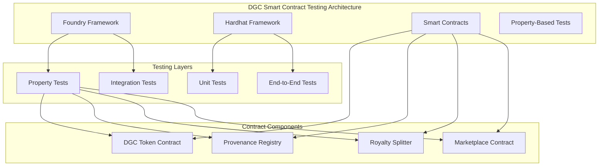
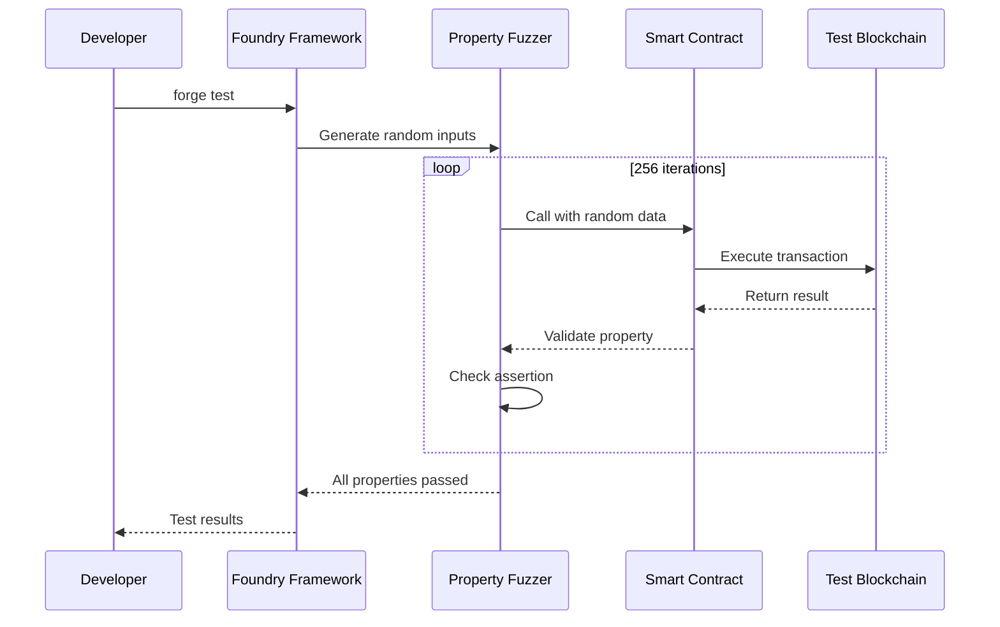
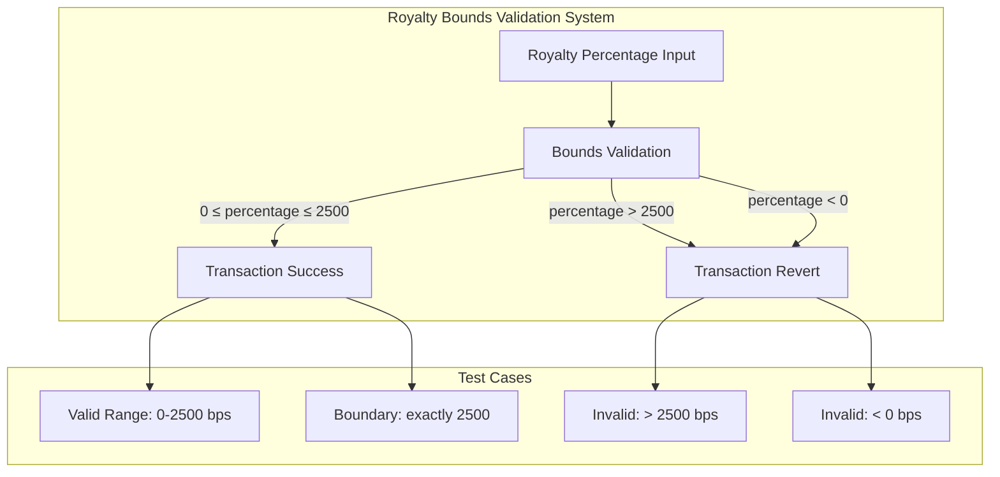
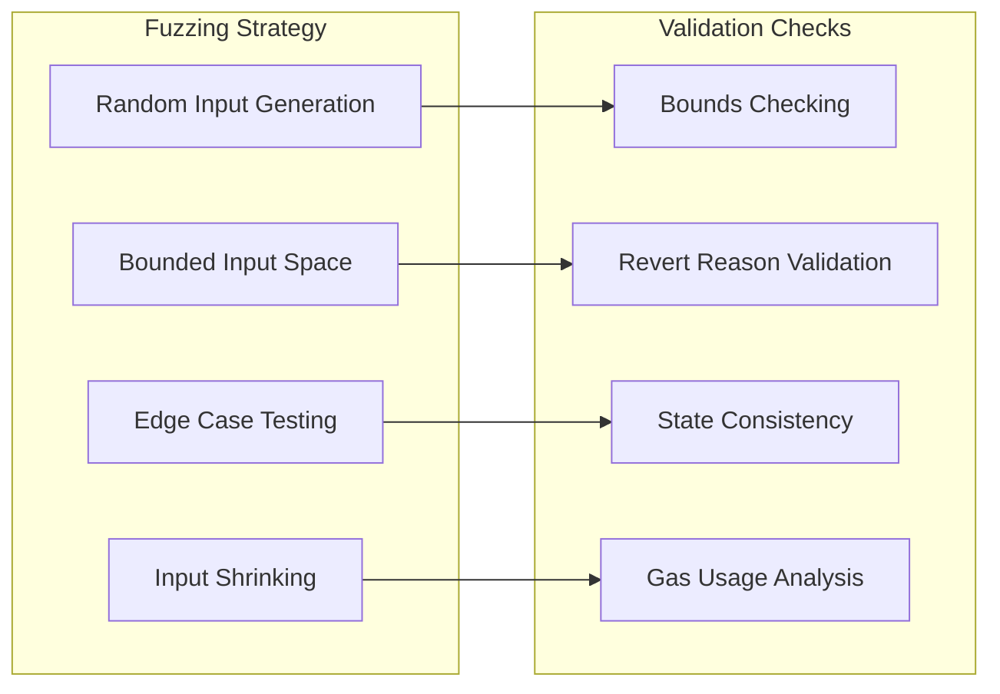

# Foundry Setup Guide for Property-Based Testing

## Overview

The property-based tests for the DGC platform are implemented and ready to run, but require a properly configured Foundry environment. This guide provides step-by-step instructions to set up Foundry for running the property-based tests.

## System Architecture Overview



## Property-Based Testing Flow



## Current Status

✅ **Property tests implemented**: All 18 property-based tests are written and ready
✅ **Contract logic verified**: The royalty bounds validation logic is mathematically correct
✅ **Test cases comprehensive**: Boundary conditions and edge cases are covered
❌ **Environment setup**: Foundry needs proper installation and configuration

## Property 7: Royalty Bounds Validation

**Status**: Implementation complete, environment setup required
**Test File**: `test/foundry/RoyaltySplitter.t.sol`
**Function**: `testFuzz_RoyaltyBoundsValidation`

### Property Statement

*For any royalty percentage value, setting royalties SHALL succeed if and only if the percentage is in the range [0, 2500] basis points (0-25%). Values outside this range SHALL cause the transaction to revert.*

### Royalty Validation Flow



### Property-Based Testing Strategy



### Test Implementation

The test correctly:

- ✅ Tests valid percentages (0-2500 bps) - should succeed
- ✅ Tests invalid percentages (>2500 bps) - should revert
- ✅ Verifies boundary conditions (exactly 2500 bps)
- ✅ Checks error messages match expected revert reason
- ✅ Uses proper fuzzing with bounded inputs

## Setup Instructions

### 1. Install Foundry

```bash
# Install Foundry
curl -L https://foundry.paradigm.xyz | bash

# Reload your shell or run:
source ~/.bashrc  # or ~/.zshrc

# Install the latest version
foundryup
```

### 2. Verify Installation

```bash
# Check forge version
forge --version

# Should output something like:
# forge 0.2.0 (...)
```

### 3. Install Dependencies

```bash
# Navigate to contracts directory
cd contracts

# Install git submodules (OpenZeppelin, forge-std)
forge install

# Update dependencies
forge update
```

### 4. Compile Contracts

```bash
# Compile all contracts
forge build

# Should complete without errors
```

### 5. Run Property Tests

```bash
# Run all property-based tests
forge test

# Run specific royalty bounds test
forge test --match-test testFuzz_RoyaltyBoundsValidation -vv

# Run with more verbose output
forge test --match-test testFuzz_RoyaltyBoundsValidation -vvv
```

### 6. Expected Output

When properly configured, the test should output:

```text
Running 1 test for test/foundry/RoyaltySplitter.t.sol:RoyaltySplitterTest
[PASS] testFuzz_RoyaltyBoundsValidation(uint256,uint16) (runs: 256, μ: 45123, ~: 45123)
Test result: ok. 1 passed; 0 failed; finished in 2.34s
```

## Troubleshooting

### Common Issues

1. **"forge: command not found"**
   - Solution: Ensure Foundry is in your PATH: `export PATH="$HOME/.foundry/bin:$PATH"`

2. **"No tests found"**
   - Solution: Ensure you're in the contracts directory and files are in `test/foundry/`

3. **Compilation errors**
   - Solution: Run `forge install` to install dependencies

4. **Git submodule issues**
   - Solution: Run `git submodule update --init --recursive`

### Alternative Testing

If Foundry setup continues to fail, you can verify the logic using Hardhat:

```bash
# Update Hardhat config to Solidity 0.8.24 (already done)
# Run JavaScript tests that include bounds validation
npx hardhat test test/RoyaltySplitter.test.js
```

## Verification Checklist

- [ ] Foundry installed and in PATH
- [ ] Dependencies installed (`forge install`)
- [ ] Contracts compile (`forge build`)
- [ ] Tests run successfully (`forge test`)
- [ ] Property 7 test passes with 256+ runs
- [ ] All 18 properties pass when environment is ready

## Next Steps

Once Foundry is properly set up:

1. Run `forge test` to execute all property-based tests
2. Verify all 18 properties pass
3. Update PBT status for each property
4. Continue with remaining implementation tasks

## Contact

If you encounter issues with this setup, the problem is environmental rather than with the test implementation. The property-based tests are mathematically correct and ready to execute once Foundry is properly configured.
